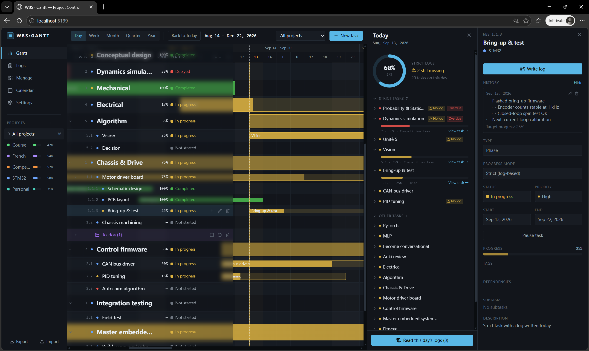
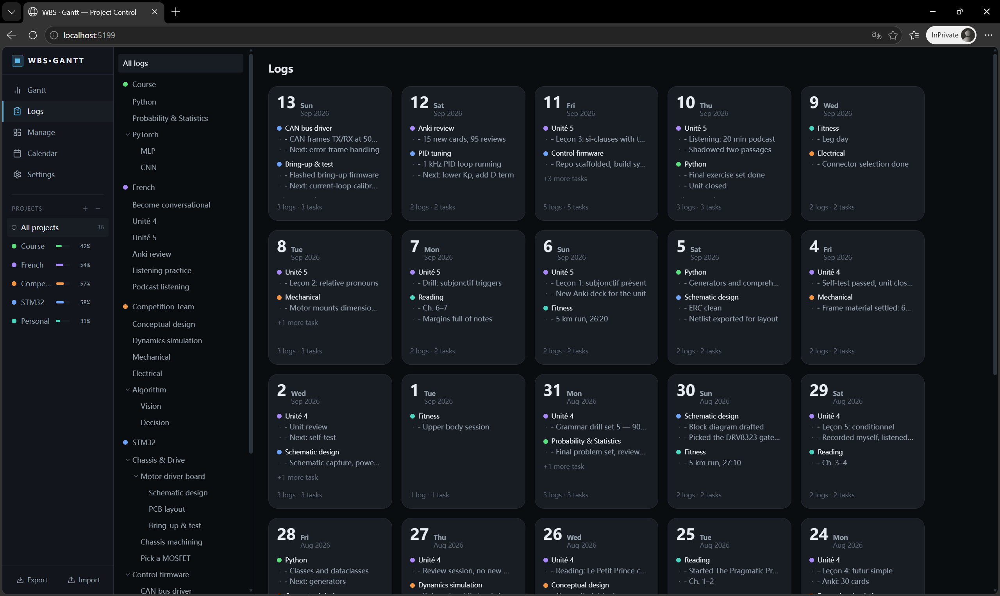
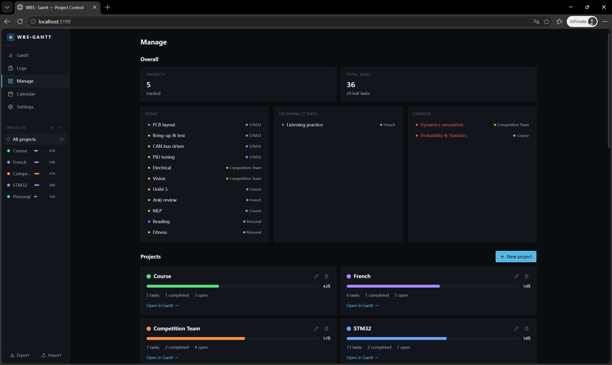
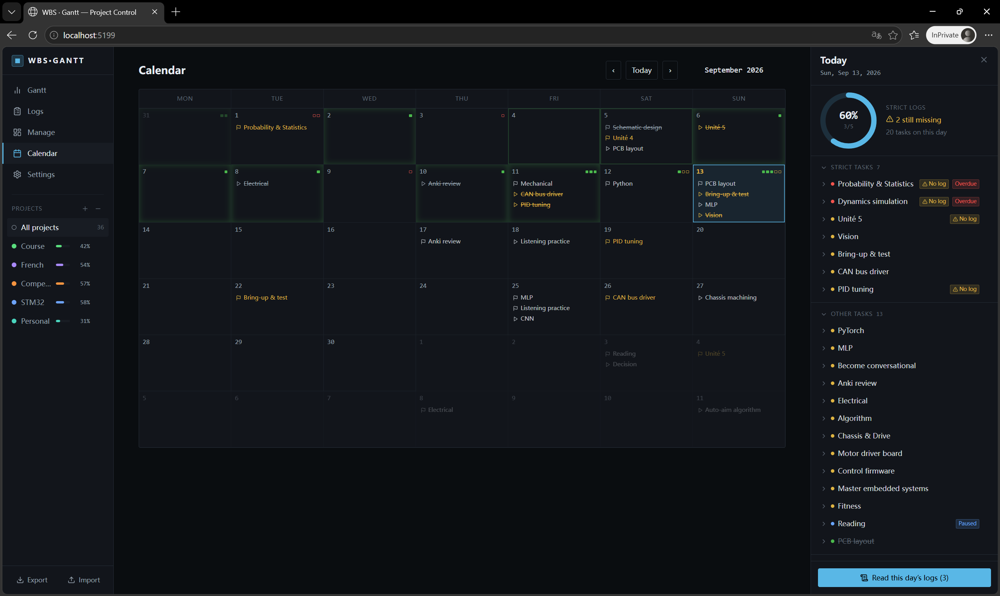
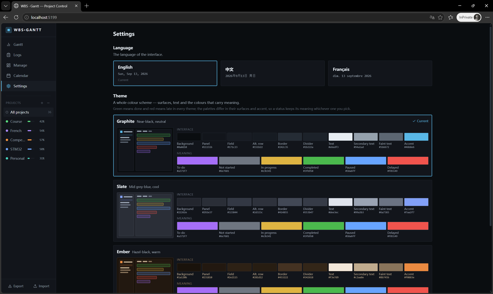

这是<h1>WBS-gantt</h1>一个面向个人事务，相当**轻量而直观高效**的任务管理工具。

它之所以清晰直观，是因为它基于甘特图这个纽带，将任务轴(y)与日期轴(x)连结在一起，而可以分别从**面向日期和面向任务**两个角度管理个人事务，如上图右侧的日期详情栏和任务详情栏。

“面向日期”和“面向任务”的理念，是设计WBS-gantt时遵循的核心思路，也是它最独特的本质。

下面介绍为了确保任务管理的严谨和周密，WBS-gantt和WBS-gantt任务所具有的一些设计。

## 进度条、严格任务与任务日志设计

WBS-gantt任务可被分为长期任务和阶段任务，亦可被分为**严格与非严格任务**。一切阶段任务都有直接显示在甘特图(gantt)中的进度条(0%-100%)来反映任务进度。非严格任务的进度条自动随日期均匀增长，到100%后自动标记为完成；而严格任务的进度条增长依赖每日为该任务填写的**任务日志**，即如果没有填写对应任务的日志，则当日该任务的进度不予累加，直到截止日期进度条若仍未填满则任务视为逾期。

任务日志的设计初衷是督促用户将精力投入到任务上，并且为**工作留痕**提供了入口。在logs界面可以按任务或者按日期管理历史任务日志。如下图。

## 任务状态与甘特图表征设计

在短期/长期任务的基础上，一个任务最多可以有六种状态：待办/未开始/进行中/已完成/暂停/逾期，对应在甘特图中的表现形式也有所区别。为保证任务管理的严谨，WBS-gantt拥有**周密的计算任务状态信息和进度信息的算法**。这里主要对待办和暂停状态进行说明。

### 待办(To-do)

是一种**「还没想好什么时候做」**的任务形态：无日期、无优先级、无进度，也不参与父任务的进度与状态汇总或是任何严格日志覆盖率，且**可以和未开始的任务相互转换**。待办任务相比处于其它状态的任务有特殊ui标注。当同一父任务的一个或多个子任务转为待办时，它们会自动归入同级的**待办文件夹**，支持勾选、批量恢复成任务或是删除。

### 暂停和恢复

暂停时甘特图里原进度条变灰，且右端在暂停日截断。恢复时从恢复当天重新开始计时，结束日期顺延。当任务从暂停中恢复后，其详情页起止日期处会显示**折叠的暂停历史**，点击可展开。

## 详情面板

面向任务/日期理念的结构基础之一，动态包含展示对象的基本信息，以及一些功能入口。项目详情(Management)里包含对project和tasks等的枚举和统计信息。

## 日历(calendar)

展示将在当天截止和在当天开始的任务，以及当天任务日志填写进度(右上角**义务方块**)。点击日期/展示的任务可以像甘特图一样唤出日期和任务详情。

至于设置，目前只上线了主题和选择语言两个选项。其中语言很夹带私货地支持了法语。

后续更新会加入负载系统等功能。期待我，以及几乎不存在的其他用户们在未来使用中提出的意见。
